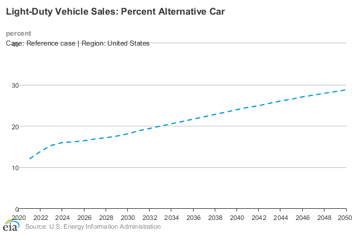

```{r setup, include=FALSE}
knitr::opts_chunk$set(
	echo = FALSE,
	message = FALSE,
	warning = FALSE
)

library(tidyverse)
library(gridExtra)
```

# 1
The systems boundary for SLC Int'l Airport is below:


I think most of the elements of the diagram are fairly straightforward, where emissions sources produced directly by the airport are entirely inside the boundary, though a few elements are worth mentioning specifically. I considered personal travel to be a part of the trip in which a dropoff/pickup occurs, so the idling and minimal driving that happens with a dropoff/pickup is entirely within the airport boundary, while the transportation to and from the airport is not. Additionally, while the airport _does_ in a sense generate flights, the in-flight emissions themselves are outside the boundary of the airport (the emissions during landing, takeoff, and taxiing are entirely in the boundary).

Another, perhaps easier, way to think about it (and how I thought about it) is a question of control. What emissions sources does the airport have total control over, and what sources are only partially under their control? The airport can, for example, control how much electricity it uses, but not the electricity to emissions ratio of the source. SLC International can (in theory at least) control the emissions of a plane while it's on the ground, but once the plane is in the air the airport has no control over the emissions.


# 2
The causal loop diagram is below:


This analysis is far from perfect, but it gives a good idea of the relationships at play. I made a few assumptions:

- An increase in gas price would lower the demand for (and therefore number of) gas-powered vehicles. This is probably not true in the short term, but is probably true in the long term.
- Emissions regulations are likely to have an impact on fuel economy, though I'm not sure in which direction. Certain regulations may cause manufacturers to use engines that burn more cleanly, but that might have a negative impact on fuel economy. However, there may also be improvements in engine emissions that _increase_ fuel economy as well.
- I am assuming that as the supply of rare earth metals decreases, battery technology will improve in a way that uses less of them. This may or not be the case, but I think it's likely.


# 3
I used the logistic growth equation to model electric vehicle shares. The equation is given as
\[f(t) = \frac{e^{a+bt}}{1+e^{a+bt}}\]
where $f(t)$ is the fraction of electric vehicles, $t$ is the year, and $a$ and $b$ are coefficients.

Data from 2011\textendash 2019 were obtained from [https://afdc.energy.gov/data/] and [https://www.epa.gov/automotive-trends/explore-automotive-trends-data#SummaryData]. The adfc data include total EV sales by year, and the epa data include information on all car production. I am only considering fully-electric vehicles as EVs for this analysis (not plug-in hybrid EVs).

```{r}
cars <- read_csv("HW1/data/table_export.csv") %>% 
	mutate(`Model Year` = as.integer(`Model Year`),
				 `Production (000)` = as.integer(`Production (000)`)) %>% 
	filter(`Regulatory Class` == "Car",
				 `Vehicle Type` == "All Car",
				 Manufacturer == "All",
				 `Model Year` %in% 2011:2019) %>% 
	mutate(`Model Year` = as.character(`Model Year`))

evs <- read_csv("HW1/data/10567_pev_sales_2-28-20.csv") %>% 
	filter(Type == "EV") %>% 
	select(-Vehicle, -Type) %>% 
	colSums() %>% 
	{tibble(Year = names(.),
					EVs = .)} 
```

Plotting the sale of EVs and total vehicles gives:

```{r}
ev_plot <- evs %>% 
	ggplot(aes(x = Year, y = EVs/1000)) +
	geom_point() +
	ylab("EV Sales (x1000)")

cars_plot <- cars  %>% 
	ggplot(aes(x = `Model Year`, y = `Production (000)`)) +
	geom_point() +
	ylim(c(0, NA)) +
	labs(x = "Year",
			 y = "Car Sales (x1000)")

grid.arrange(ev_plot, cars_plot, ncol = 1)
```

And the share of EVs:

```{r, fig.height=2.7}
evshare <- cars %>% 
	transmute(Year = `Model Year`,
						Cars = `Production (000)` * 1000) %>% 
	left_join(evs, by = "Year") %>% 
	mutate(ev_share = EVs / Cars)

evshare %>% 
	ggplot(aes(x = Year, y = ev_share)) +
	geom_point() +
	ylab("Share of EVs Sold vs. All Cars")
```

In order to solve this model, I first rearranged the growth equation:

\[f(t) = \frac{e^{a+bt}}{1+e^{a+bt}} \implies
f(t) + f(t)(e^{a+bt}) = e^{a+bt} \implies
f(t) = e^{a+bt}(1-f(t)) \]
\[\implies \frac{f(t)}{1-f(t)} = e^{a+bt} \implies
\ln\left(\frac{f(t)}{1-f(t)}\right) = a+bt\]

for all $0 < f(t) < 1$. \medskip

Treating \(\ln\left(\frac{f(t)}{1-f(t)}\right)\) as the new dependent variable and plotting:

```{r, fig.height=2.7}
logevshare <- evshare %>% 
	mutate(logshare = log(ev_share),
				 Year = as.numeric(Year))

fitline <- lm(logshare~Year, logevshare)

logevshare %>% 
	ggplot(aes(x = Year, y = logshare)) +
	geom_point() +
	geom_smooth(method = 'lm') +
	scale_x_continuous(
		breaks = min(logevshare$Year):max(logevshare$Year)) +
	theme(panel.grid.minor.x = element_blank()) +
	ylab("Log of EV Share")
```

Where the best-fit line is given by \(\ln\left(\frac{f(t)}{1-f(t)}\right) = -788.6 + 0.3889t,
\ \therefore\  a=-788.6, b=0.3889\). Putting these values back in the original equation gives:

\[f(t) = \frac{e^{-788.6 + 0.3889t}}{1+e^{-788.6 + 0.3889t}}.\]

And adding this function to the original plot and expanding the time range:

```{r}
a <- fitline$coefficients["(Intercept)"]
b <- fitline$coefficients["Year"]

growthfun <- function(x){
	exp(a+b*x)/(1+exp(a+b*x))
}

evshare %>%
	mutate(Year = as.numeric(Year)) %>% 
	ggplot(aes(x = Year, y = ev_share)) +
	geom_point() +
	geom_function(fun = growthfun) +
	xlim(NA,2050) +
	ylab("Share of EVs Sold vs. All Cars")
```

```{r}
time_at_share <- function(share){
	(log(share/(1-share)) - a) / b
}
```

Solving the equation
\[0.5 = \frac{e^{-788.6 + 0.3889t}}{1+e^{-788.6 + 0.3889t}}\]
gives a value of `r time_at_share(0.5) %>% round(1)`, which is the time at which EV sales account for half of all car sales.

\newpage

# 4
The Annual Energy Outlook's estimation for EV penetration is given as:



This is a much shallower prediction, i.e. EVs do not penetrate nearly as quickly.